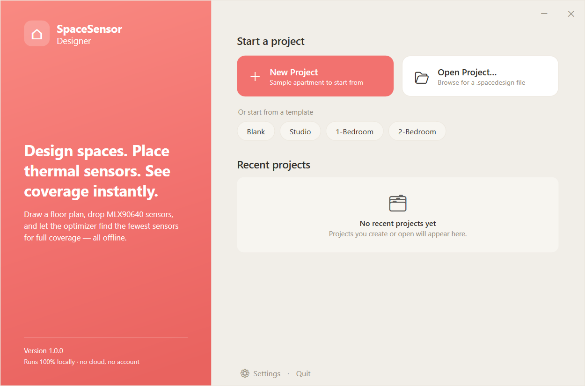
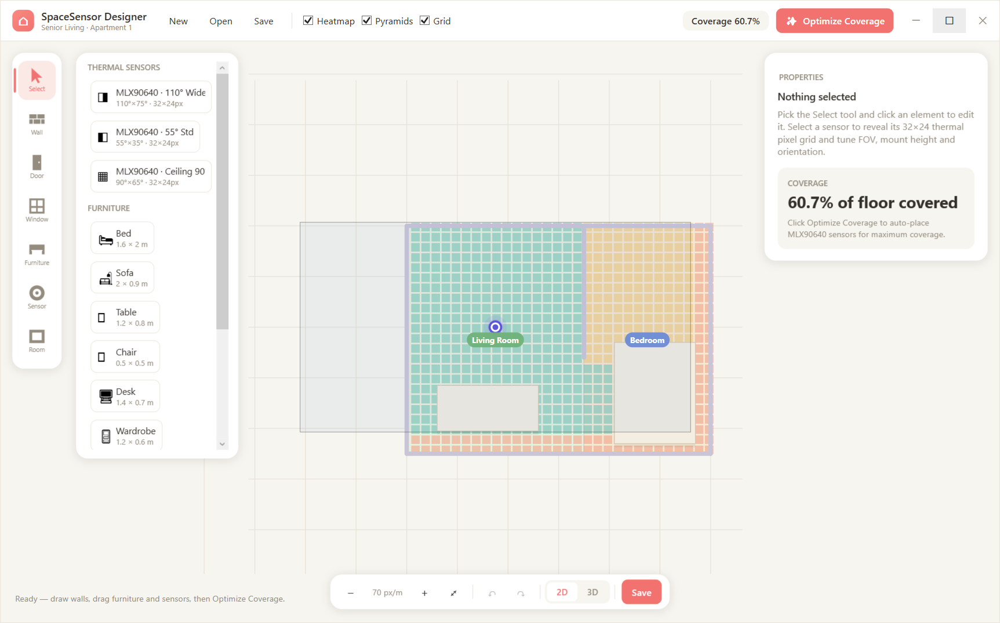
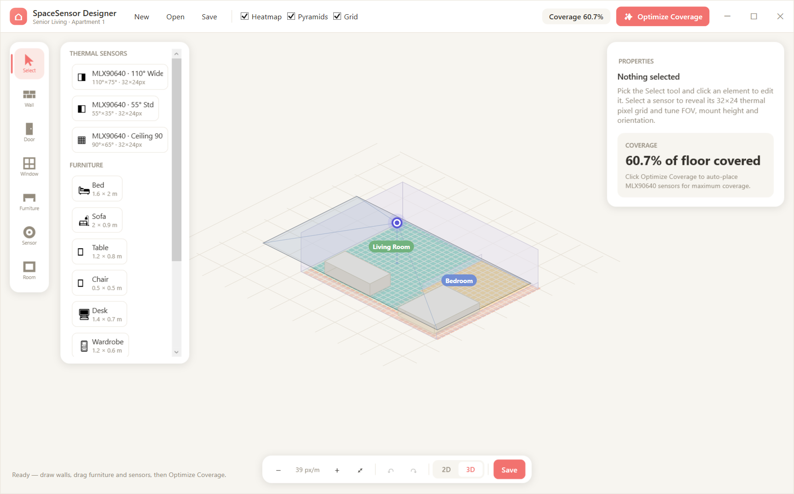
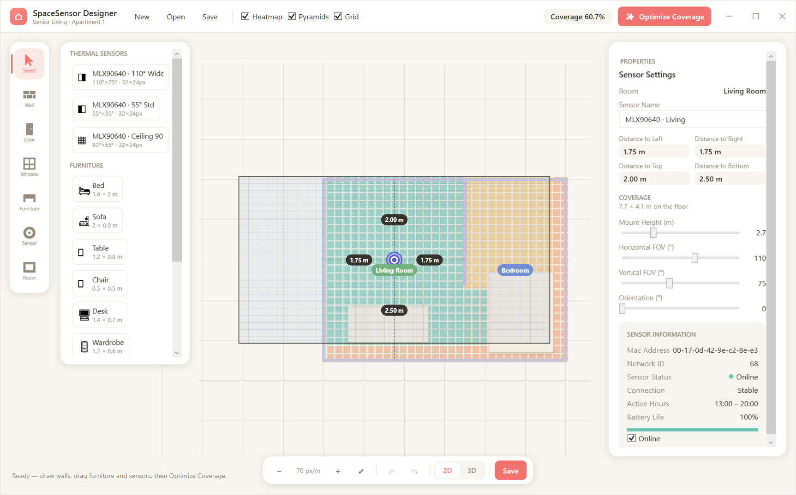
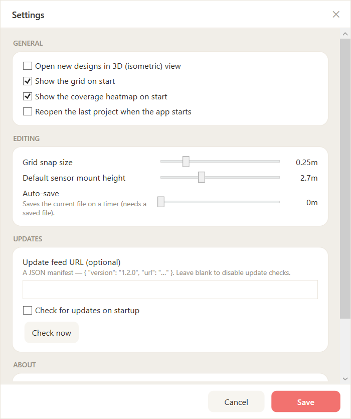

# SpaceSensor Designer

A modern Windows desktop app for drag-and-drop space planning with intelligent sensor
coverage planning. Draw an apartment, place furniture and sensors, see a live coverage
heatmap, and let a local greedy optimizer suggest sensor positions — all fully offline.

The app opens to a **home screen** — start a new project, pick a template, or reopen a
recent design — then drops you into the designer:



| 2D top-down | 2.5D isometric |
|---|---|
|  |  |

Selecting a sensor reveals its 32×24 thermal pixel grid, footprint dimensions, and FOV controls:



## Product shell

- **Home / start screen** — a branded landing page with **New Project**, template
  quick-starts (Blank / Studio / 1-Bed / 2-Bed), **Open Project…**, and a **Recent
  projects** list (persisted to `%AppData%\SpaceSensor Designer\recent.json`). A **⌂ Home**
  button in the designer returns here, prompting to save unsaved changes first.
- **Settings** (`⚙`) — persisted preferences that actually drive the editor: default
  2D/3D view, show grid / heatmap on start, grid snap size, default sensor mount height,
  **auto-save interval**, reopen-last-project on launch, and an optional **update feed URL**
  with a *Check for updates* action. Saved to `settings.json` in the same folder.

  

- **App icon & branding**, a real **Windows installer** (Inno Setup) with a `.spacedesign`
  file association, and a one-command build script — see *Packaging* below.

## Features

- **2D top-down and 2.5D isometric views** of the same plan (toggle in the toolbar).
  The isometric view uses a dollhouse cutaway: camera-facing walls render low and
  translucent so the interior stays visible, with sensor coverage volumes and distance labels.
- **Space designer** — wall drawing with grid snapping (click-chain segments, `Esc` to
  finish), rectangle room tool with room types + color coding, functional **door & window**
  tools (snap onto the nearest wall), and a furniture library (bed, sofa, table, kitchen
  counter, toilet, …) rendered as **illustrated models** (not boxes) with drag-and-drop
  placement and on-canvas **resize + rotate handles** in the 2D view.
- **Doors, windows & occluders affect coverage** — an open **doorway lets thermal
  line-of-sight pass through** the wall (glass **windows** stay opaque to LWIR, so they
  still block); a tall **wardrobe casts a thermal shadow**. Coverage updates live.
- **Per-room coverage** breakdown (e.g. "Living Room 91% / Bedroom 21%") with progress bars,
  a **confidence-graded heatmap** (coverage fades toward each footprint's edge), and an
  **Overlap view** that colours the floor by how many sensors see each area (redundancy).
- **Multi-select** — marquee-drag or Shift-click to select many elements, then move them
  together, **Delete**, or **Ctrl+D** to duplicate.
- **Smarter optimizer** — greedy set-cover followed by a local-search refinement pass.
- **Import a floor plan to trace over** — a **PNG/JPG image** *or* a **PDF** (the first page
  is rendered via PDFium); adjustable opacity, scale, and drag-to-reposition, saved with the plan.
- **Auto-detect rooms** — importing a plan runs room detection automatically (and there's a
  **Detect rooms** button to re-run). Classical CV: Otsu threshold → keep the largest wall
  structure (so **room labels & furniture symbols are ignored**) → **dilate to seal door/window
  gaps** so rooms separate → flood-fill the enclosed regions → map each to a world-space room.
  If nothing can be found it pops a dialog asking you to **define rooms manually** with the Room
  tool. Detected rooms are also **walled off** (a wall is generated around each), so the coverage
  engine blocks a sensor's line-of-sight between rooms — a sensor can't see through a wall into the
  next room, so the optimizer places at least one sensor **per room** (more for rooms larger than a
  single footprint). Room sizes come from the plan's **scale** (metres-per-pixel) — set it correctly
  (Scale slider) or all dimensions, and therefore the sensor count, will be off.
- The coverage heatmap tints only the **covered** floor (graded green) and stays translucent, so
  an imported plan reads clearly underneath — uncovered floor isn't flooded red.
- **Multi-floor projects** — a project holds one or more floors/apartments; switch, add,
  remove and rename them from the header. Saved as one `.spacedesign` project file (older
  single-floor files still open).
- **Templates & CAD import** — start a floor from a **Studio / 1-Bed / 2-Bed** template, or
  **Import DXF** to bring walls in from a CAD drawing (`LINE` / `LWPOLYLINE` entities).
- **Thermal-sensor coverage engine** — sensors are modelled on the **Melexis MLX90640**
  (a 32×24 far-infrared array). A ceiling-mounted unit points straight down, so its floor
  coverage is a **rectangular pyramid footprint** (a frustum base) whose size grows with
  mount height and the horizontal/vertical FOV — *not* a circular cone. The wide variant is
  110°×75°; at 2.7 m that projects a 7.7 × 4.1 m footprint. A 0.2 m grid is evaluated per
  cell (inside-footprint + wall line-of-sight); the heatmap shows **green** (covered),
  **yellow** (in footprint but wall-blocked), **red** (uncovered), with a live coverage %.
  Selecting a sensor overlays its 32×24 pixel grid and footprint dimensions.
  The **floor area** is defined by the rooms you draw — or, if you haven't drawn any rooms,
  the interior of your **traced walls' bounding box** — so coverage and Optimize stay inside
  the apartment instead of spilling across the canvas.
- **Optimize Coverage** — a deterministic greedy set-cover algorithm suggests the minimal
  MLX90640 set to reach ~95% coverage; suggestions animate onto the canvas and commit as a
  single undoable action. No AI, no cloud — everything runs locally in milliseconds.
- **Editing** — select/move/delete for every element, rotate + resize furniture via the
  properties panel, full undo/redo, save/load as `.spacedesign` JSON.
- **Live telemetry** — selecting a sensor shows a live **LIVE FEED** panel: online status,
  last-seen, current **occupancy**, ambient / peak temperature, and battery, refreshed on a
  timer. It runs off an `ITelemetrySource`; the app ships a `SimulatedTelemetrySource`
  (clearly tagged **SIMULATED**) so a real device backend (MQTT/BLE/HTTP) can drop straight in.
- **Export & reporting** — the **Export ▾** menu produces a self-contained **HTML coverage
  report** (overall + per-floor + per-room coverage, a **bill of materials**, and a sensor
  **install schedule** with positions/heights/footprints — print → PDF from any browser), a
  **CSV** sensor schedule, and a **PNG** snapshot of the current floor.

### Still deferred (future phases)
- **Auto-wall detection** — rooms are auto-detected from an imported plan, but **walls** (for
  line-of-sight occlusion) aren't yet; draw them with the Wall tool, or use DXF import for exact
  wall geometry. Detected rooms are also approximated as **rectangles** (their bounding box), so
  redraw non-rectangular rooms by hand.
- **Real-hardware telemetry** — the live feed is a simulator; wiring an actual device API
  (implement `ITelemetrySource`) and cloud sync / multi-user collaboration remain.
- **Auto-update** is wired but *bring-your-own-server*: point the Settings *update feed URL*
  at a JSON manifest (`{ "version": "1.2.0", "url": "…" }`) to enable checks. There is no
  hosted feed. **Code signing** is supported by the installer/build script but requires your
  own certificate (`build-installer.ps1 -PfxPath …` or `-CertThumbprint …`).

## Solution layout

```
SpaceSensorDesigner.sln
├─ src/SpaceSensorDesigner.Core     # UI-free logic: models, geometry, coverage,
│                                   # optimizer, serialization, undo — unit-testable
├─ src/SpaceSensorDesigner.App      # WPF app: MVVM, custom-rendered canvas, XAML shell
└─ tests/SpaceSensorDesigner.Tests  # xUnit: coverage, optimizer, serialization
```

Key pieces:

| Area | Files |
|---|---|
| Data model | `Core/Models/*` (`FloorPlan`, `Room`, `Wall`, `FurnitureItem`, `Sensor`, `Vec2`) |
| Coverage engine | `Core/Coverage/CoverageCalculator.cs`, `CoverageGrid.cs` |
| Optimizer | `Core/Optimization/SensorOptimizer.cs` (greedy set-cover) |
| Room detection | `Core/Vision/RoomDetector.cs` (Otsu + flood-fill), `App/Services/RoomDetectionService.cs` (pixels → world rooms) |
| Telemetry | `Core/Telemetry/*` — `ITelemetrySource`, `SimulatedTelemetrySource`, `SensorTelemetry` |
| Export/report | `Core/Export/CoverageReport.cs` (HTML report, CSV schedule, BOM) |
| Geometry | `Core/Geometry/GeometryUtils.cs` (LoS, point-in-polygon), `SensorFootprint.cs` (pyramid footprint), `IsometricProjection.cs` |
| Persistence | `Core/Serialization/ProjectSerializer.cs` (multi-floor `.spacedesign` JSON), `FloorPlanSerializer.cs` |
| Project | `Core/Models/DesignProject.cs` (floors), `Core/Models/Opening.cs` (doors/windows) |
| Undo/redo | `Core/Undo/UndoRedoManager.cs` |
| Canvas | `App/Controls/DesignSurface.cs` (input, pan/zoom, drag-drop), `App/Rendering/SceneRenderer.cs` |
| MVVM | `App/ViewModels/MainViewModel.cs` + properties view models (CommunityToolkit.Mvvm) |
| Shell | `App/MainWindow.xaml` (designer), `App/HomeWindow.xaml` (start screen), `App/SettingsWindow.xaml`, `App/Resources/Theme.xaml`, `DataTemplates.xaml` |
| App services | `App/Services/*` — `AppSettings`, `RecentFilesService`, `UpdateService`, `AppPaths`, `AppInfo` (persist to `%AppData%`) |
| Packaging | `installer/installer.iss` (Inno Setup), `installer/build-installer.ps1` (publish + sign + compile) |

## NuGet packages

| Package | Project | Purpose |
|---|---|---|
| `CommunityToolkit.Mvvm` 8.4 | App | `ObservableObject`, source-generated `[RelayCommand]` |
| `Docnet.Core` 2.6 | App | Renders PDF floor plans to bitmaps (bundled PDFium) |
| `WPF-UI` 4.3 | App | Modern Fluent controls/theme (available for future polish) |
| `Microsoft.Xaml.Behaviors.Wpf` 1.1 | App | MVVM interaction behaviors |
| `xunit` + `xunit.runner.visualstudio` + `Microsoft.NET.Test.Sdk` | Tests | Unit tests |

Serialization uses the built-in `System.Text.Json` — no extra package.

## Build & run

Prerequisites: **.NET 8 SDK** (and optionally Visual Studio 2022 17.8+ with the
".NET desktop development" workload).

```powershell
# from the repo root
dotnet build                                        # build everything
dotnet test                                         # run the unit tests
dotnet run --project src/SpaceSensorDesigner.App    # launch the app
```

Or open `SpaceSensorDesigner.sln` in Visual Studio, set **SpaceSensorDesigner.App** as
the startup project, and press `F5`.

### Quick tour
1. A sample apartment loads on start. Toggle **2D / 3D** in the toolbar.
2. Pick the **Wall** tool and click to chain wall segments (`Esc` finishes; the dashed
   preview shows live length in metres).
3. Pick the **Room** tool and drag a rectangle; set its type (Bedroom, Kitchen, …) in the
   properties panel for color coding.
4. Drag furniture and sensors from the left library onto the canvas (or use the
   Furniture/Sensor tools to click-drop).
5. Select a sensor to tune range / FOV / orientation / height — the heatmap updates live.
6. Click **✨ Optimize Coverage** and watch suggested sensors animate in.
7. Save via the toolbar (`.spacedesign` JSON), undo/redo from the status bar.

Mouse: **left** = tool action / select / drag-move · **right or middle drag** = pan ·
**wheel** = zoom at cursor · **Delete** = remove selection.

## Publish a single-file executable

```powershell
dotnet publish src/SpaceSensorDesigner.App -c Release -r win-x64 `
  -p:PublishSingleFile=true --self-contained true
```

Output: `src/SpaceSensorDesigner.App/bin/Release/net8.0-windows/win-x64/publish/SpaceSensorDesigner.App.exe`
(~150 MB self-contained; add `--self-contained false` for a ~5 MB exe that requires the
.NET 8 Desktop Runtime on the target machine).

## Packaging as an installer

### Option A — Inno Setup (included, recommended)

A ready-to-use Inno Setup script lives at [`installer/installer.iss`](installer/installer.iss),
with a one-command build wrapper that publishes **and** compiles the installer:

```powershell
# 1. Install Inno Setup 6:  https://jrsoftware.org/isinfo.php
# 2. Build (publish -> installer\dist\SpaceSensorDesigner-Setup-<ver>.exe):
installer\build-installer.ps1
```

The installer installs the self-contained app, creates Start-menu (and optional desktop)
shortcuts, and associates `.spacedesign` project files so double-clicking one launches the
app. To produce a **signed** build, pass a certificate — the script signs both the app exe
and the setup:

```powershell
installer\build-installer.ps1 -PfxPath cert.pfx -PfxPassword (Read-Host -AsSecureString)
# or, using an installed certificate:
installer\build-installer.ps1 -CertThumbprint "AB12…CD"
```

Without a certificate the build still succeeds and emits an **unsigned** installer.

### Option B — MSIX (Microsoft Store / modern deployment)
1. In Visual Studio, add a **Windows Application Packaging Project** to the solution and
   reference `SpaceSensorDesigner.App`.
2. Set the packaging project as startup, configure `Package.appxmanifest`
   (identity, logo, file-type association for `.spacedesign`).
3. `Project → Publish → Create App Packages` — sign with a dev cert for sideloading or a
   trusted cert / Store account for distribution. MSIX gives auto-updates and clean
   install/uninstall, at the cost of certificate management.

## Performance notes

- Coverage recomputation is debounced (120 ms) and computed on a 0.2 m grid; a typical
  8×6 m apartment is ~1,200 floor cells × sensors — sub-millisecond per evaluation.
- The heatmap renders as three batched frozen `StreamGeometry` fills (one per coverage
  state), not per-cell rectangles.
- The optimizer samples candidates on a 0.75 m lattice; on typical apartments it converges
  in well under a second.
